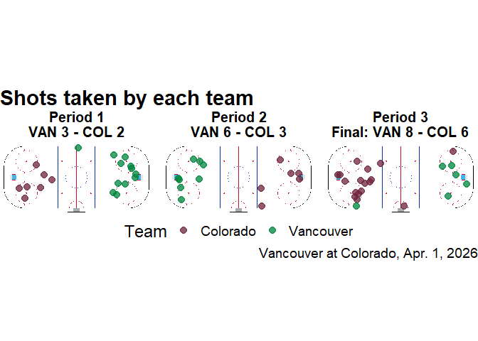
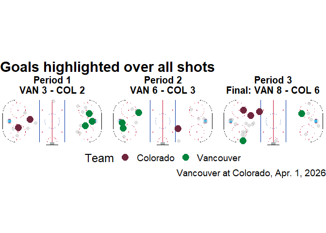
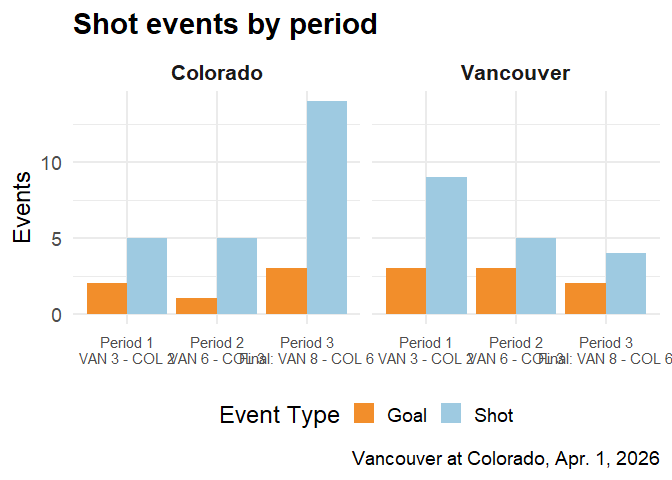

# Hockey Shot Analysis

## Data Introduction

- This project uses NHL play-by-play data from the 2025-2026 regular
  season.

- Each event includes information such as game ID, period, shot type,
  team context, and rink coordinates.

- Because the data include shot location, we can study where offenses
  generated chances on the ice.

- I included only shot-on-goal and goal events, and removed rows with
  missing shot type values.

## Questions of Interest

- How did shot location differ between the home and away teams in this
  game?

- Did shot patterns change from period to period as the game progressed?

